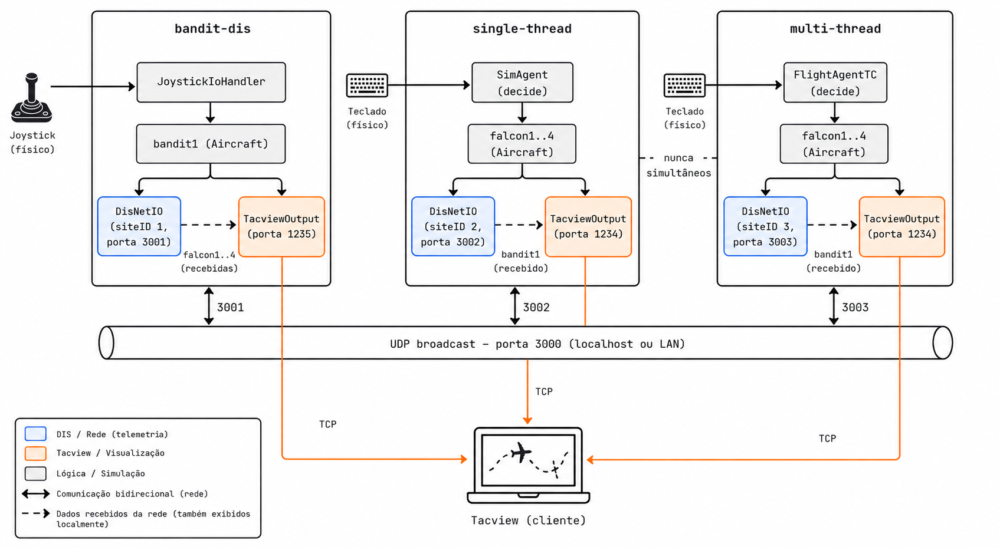

# poc-mixr

Prova de conceito para desenvolver **novos modelos de simulação** sobre o framework
[MIXR](https://mixr.dev) (fork empacotado como pacote Conan `mixr/1.0.5`) e sobre o
[BehaviorTree.CPP v3](https://github.com/BehaviorTree/BehaviorTree.CPP)
(`behaviortree.cpp.asa/3.5.6`).

O MIXR **não** é o objeto de desenvolvimento: entra como dependência binária, resolvida pelo
Conan, e nunca é modificado. O que se desenvolve aqui são os **modelos** — players, dinâmicas,
sensores, sistemas, e a camada de decisão — carregados pelo host em tempo de execução, como
**plugins** (`dlopen`). A pergunta que o repositório responde não é "como fazer um simulador", é
*"o que o MIXR já entrega pronto, o que sobra para escrever, e qual é o preço de cada escolha"*.

O fork empacotado é **headless**: não publica `mixr_graphics`, `glut`, `instruments` nem
`ighost`. Toda a visualização é feita por **Tacview Real-Time Telemetry**, exportada pela
biblioteca compartilhada [shared/xtacview/](shared/xtacview/).

> **Documentação, comentários de código e mensagens de console são em português do Brasil.**
> Identificadores, nomes de slot e nomes de fábrica ficam em inglês — são os originais do MIXR.

---

## Índice

1. [Funcionalidades exploradas](#1-funcionalidades-exploradas)
2. [Pré-requisitos](#2-pré-requisitos)
3. [Build](#3-build)
4. [Rodar](#4-rodar)
5. [Verificar](#5-verificar)
6. [Como o projeto se organiza](#6-como-o-projeto-se-organiza)
7. [Os quatro subprojetos](#7-os-quatro-subprojetos)
8. [Os modelos são plugins](#8-os-modelos-são-plugins)
9. [Bibliotecas compartilhadas](#9-bibliotecas-compartilhadas)
10. [`contexts/` — onde consultar o framework](#10-contexts--onde-consultar-o-framework)
11. [Onde ler mais](#11-onde-ler-mais)

---

## 1. Funcionalidades exploradas

Cada linha foi levada até rodar e ser medida — a coluna "detalhe" aponta onde a funcionalidade é
disseca por inteiro, com números medidos e as armadilhas encontradas rodando.

| # | funcionalidade | detalhe |
|---|---|---|
| 1 | **Carga dinâmica de modelos** — o modelo (players, dinâmicas, decisão) é um `.so` carregado por `dlopen` em tempo de execução, não um alvo linkado do host; o mesmo executável roda com modelos diferentes, inclusive um "desconhecido" escrito só contra o SDK publicado, sem trocar uma linha do host | [§8](#8-os-modelos-são-plugins), [models/README.md](models/README.md) |
| 2 | **Elevação de terreno** — banco SRTM real consultado pela decisão, virando piso anti-CFIT da evasão e piso AGL do comportamento de segurança | [src/poc/single-thread/README.md §10](src/poc/single-thread/README.md#10-elevação-de-terreno) |
| 3 | **Recorder → Tacview** — visualização por *Real-Time Telemetry*, escrita como `OutputHandler` de verdade na cadeia nativa do gravador | [shared/xtacview/](shared/xtacview/), [CLAUDE.md](CLAUDE.md) |
| 4 | **Dinâmica 6-DOF** — aerodinâmica completa via JSBSim, pelo adaptador nativo `JSBSimModel` | [src/poc/single-thread/README.md §6.2](src/poc/single-thread/README.md#62--jsbsimmodel---a-dinâmica-6-dof) |
| 5 | **Interação entre agentes por eventos** — quem detecta o intruso avisa os outros pelo `Datalink` nativo, sem ponteiro direto entre players | [src/poc/single-thread/README.md §9](src/poc/single-thread/README.md#9-interação-entre-players) |
| 6 | **Paralelismo com determinismo garantido** — os players decidem no pool de threads de tempo crítico do framework, e o estado final é idêntico com 1, 2 e 4 threads | [§7](#7-os-quatro-subprojetos), [tests/README.md](tests/README.md) |
| 7 | **Comportamento com UBF + BehaviorTree.CPP** — `AbstractState`/`AbstractBehavior`/`AbstractAction` nativos, arbitrados por voto, com uma árvore v3 carregada de XML como política interna | [src/poc/single-thread/README.md §8](src/poc/single-thread/README.md#8-a-cadeia-de-decisão-ubf--behaviortree) |
| 8 | **Controle por joystick físico, com fallback automático** — HOTAS de verdade ou `Autopilot` *scripted*, decidido a cada frame, sem reiniciar | [CLAUDE.md](CLAUDE.md), seção `shared/xjoystick` |
| 9 | **Interoperabilidade DIS nativa e bidirecional** — o intruso roda num processo à parte e é recebido só pela rede (IEEE 1278/DIS); as outras pocs emitem de volta | [src/poc/bandit-dis/](src/poc/bandit-dis/), [CLAUDE.md](CLAUDE.md) |
| 10 | **Log e mensagens configuráveis por EDL** — nível/*stream* persistido em arquivo, e telemetria/eventos escolhidos por configuração (sem recompilar), em NDJSON | [CLAUDE.md](CLAUDE.md), seções `shared/xlog` e `shared/xmsg` |
| 11 | **Detecção de vazamento pelo metadado do próprio framework** — contadores de instâncias vivas/pico/total por classe (`MetaObject`), ao vivo num painel ou comparando duas durações num teste | [app/README.md §7](app/README.md#7-aba-memória), [tests/README.md](tests/README.md) |
| 12 | **Painel de controle interativo** — carregar cenário, pausar/acelerar/frear, navegar um mapa clicável, e até rodar a simulação até um nó específico da árvore de comportamento ser atingido | [app/README.md](app/README.md) |

E mais uma, que não é funcionalidade e sim consequência: **onde a decisão roda é uma escolha de
integração, não do modelo.** É o que os subprojetos gêmeos existem para demonstrar — o mesmo
modelo, byte a byte, trocando só o agente do UBF. Ver [§7](#7-os-quatro-subprojetos).

---

## 2. Pré-requisitos

| ferramenta | versão | por quê |
|---|---|---|
| **Conan** | ≥ 2.0 | resolve `mixr/1.0.5`, `behaviortree.cpp.asa/3.5.6`, `ftxui/7.0.3` |
| **Meson** | ≥ 1.0 | sistema de build |
| **Ninja** | qualquer | *backend* do Meson |
| **GCC ≥ 7** ou **Clang ≥ 5** | — | o projeto compila em **C++17** |
| **gzip** | qualquer | descomprime o tile SRTM na primeira execução |
| **Tacview** (Advanced ou Standard) | opcional | recebe a telemetria ao vivo |

JSBSim, protobuf, OpenRTI, zlib e expat vêm como dependências **transitivas** do MIXR — não
precisam ser pedidos. O [conanfile.py](conanfile.py) declara só o necessário direto.

---

## 3. Build

Toolchain: **Conan 2.x** → **Meson/Ninja** → **Makefile** (orquestra). São **três projetos
Meson**, em ordem obrigatória — o(s) modelo(s) são construídos **antes** do host:

```bash
make configure   # conan install + meson setup do HOST -> build/
make build       # dispara sdk + models sozinho, depois o host -> build/
make install     # copia os binários para dist/bin/ (opcional)
make test        # as suítes do host e do(s) modelo(s) -- precisa de -Dtests=true no configure
make clean       # remove todos os build*/ e o dist/
make help        # lista todos os alvos, com descrição
```

No dia a dia basta `make configure && make build`. Ver [models/README.md](models/README.md) para
o detalhe de cada etapa (`sdk`, `models`) e [§8](#8-os-modelos-são-plugins) para o porquê da
ordem.

**AddressSanitizer:** `make test-asan` instrumenta host e modelo, roda sob LeakSanitizer e
reverte no final.

### Gotcha: rpath das dependências Conan

As `.so` do MIXR/BehaviorTree.CPP/JSBSim vivem no cache do Conan. O Meson descarta o
`build_rpath` no `install` (por design) e `-Wl,--disable-new-dtags` não é decorativo (RPATH é
herdado por dependências transitivas, RUNPATH não) — os dois detalhes já estão resolvidos em
todo `executable()` do repositório. Conferência após `make install`:
`ldd dist/bin/<nome> | grep 'not found'` (silêncio = ok). `dist/` **não é auto-contido**.

---

## 4. Rodar

**Sempre a partir da raiz do repositório** — todos os binários resolvem `configs/`/`data/` por
caminho relativo.

| subprojeto | comando | Tacview | o quê |
|---|---|---|---|
| [`app`](app/) | `make run-app` | 1236 | painel de controle interativo — **comece por aqui** |
| [`single-thread`](src/poc/single-thread/) | `make run-single-thread` | 1234 | decisão no `( SimAgent )` nativo, thread de background |
| [`multi-thread`](src/poc/multi-thread/) | `make run-multi-thread` | 1234 | o mesmo modelo, decisão no `( FlightAgentTC )` próprio, fase 3 |
| [`bandit-dis`](src/poc/bandit-dis/) | `make run-bandit-dis` | 1235 | só o intruso, pilotável por joystick, emitindo DIS |

`single-thread`/`multi-thread` são **alternativas** entre si (nunca rodam juntos); qualquer um
roda sozinho ou ao lado do `bandit-dis`, que entrega o intruso **só pela rede** (DIS) — nenhuma
das pocs tem mais um `bandit1` local:

```bash
make run-bandit-dis        # terminal 1
make run-single-thread     # terminal 2 -- ou run-multi-thread, ou run-app
```



O `app` (painel de controle) roda **sozinho**, com seus próprios cenários herméticos e sua
própria porta de Tacview — documentação completa, com **todos os comandos e atalhos**, em
**[app/README.md](app/README.md)**.

**Opções de linha de comando** de `single-thread`/`multi-thread` (`bandit-dis` não tem CLI; `app`
tem as suas próprias, ver [app/README.md §3](app/README.md#3-linha-de-comando)):

| opção | efeito |
|---|---|
| `-f <arquivo>` | usa outro modelo de cenário (`.epp.in`) |
| `-threads <N>` | força `numTcThreads` do pool nativo de tempo crítico |
| `-deterministic <N>` | roda N frames de passo fixo e despeja o estado, em vez de tempo real |

**Teclado** em `single-thread`/`multi-thread` (terminal interativo — ver
[`shared/xclock/`](shared/xclock/)): `+`/`-` acelera/freia, `espaço`/`p` pausa, `1` tempo real,
`Ctrl+C` encerra. `bandit-dis` só tem `Ctrl+C`.

**Tacview:** *File > Real-Time Telemetry*, na porta de cada subprojeto (tabela acima). Com o
binário no WSL2 e o Tacview no Windows, se `127.0.0.1` não conectar, use o IP que `hostname -I`
devolve dentro do WSL2 — passo a passo completo, inclusive para uma terceira máquina na rede,
no [CLAUDE.md](CLAUDE.md), seção `shared/xtacview`.

---

## 5. Verificar

```bash
meson configure build -Dtests=true   # a suíte fica atrás desta opção
make test                            # as suítes do host e do(s) modelo(s)

make check-single-thread   # determinismo com a decisão no laço de background
make check-multi-thread    # determinismo com os 4 agentes decidindo em paralelo, na fase 3
make compare-single-multi  # lista o que difere entre os dois subprojetos (deve ser só o agente)
make test-asan             # LeakSanitizer na single-thread (build separado, lento)
```

Detalhe completo — o que cada camada de teste prova, e por que reprodutibilidade não é a mesma
coisa que correção — em **[tests/README.md](tests/README.md)**.

---

## 6. Como o projeto se organiza

```
poc-mixr/
├── app/                    o painel de controle (TUI) -- unico ocupante da pasta, fora de src/
├── src/                    subprojetos "poc": um executavel independente por pasta
│   ├── single-thread/      decisao no ( SimAgent ) nativo, em updateData() -- thread de background
│   ├── multi-thread/       decisao no ( FlightAgentTC ) proprio, na fase 3 do frame de tempo critico
│   └── bandit-dis/         o intruso sozinho -- joystick/Autopilot + emissao DIS, sem UBF nenhum
├── models/                 o(s) MODELO(s) -- projetos Meson a parte, carregados como plugin (ver §8)
│   ├── flight/             o modelo de producao (o que os quatro subprojetos acima carregam)
│   ├── missile/            segundo modelo -- demo academica de missil guiado 6-DOF
│   └── fixtures/stub/      um modelo minimo, so contra o SDK -- prova que o contrato basta
├── shared/                 bibliotecas x<nome> reaproveitadas entre subprojetos (ver §9)
├── tests/                  a suite do HOST (a de cada modelo vive dentro do proprio models/<nome>/)
├── contexts/                material de consulta sobre MIXR e BehaviorTree.CPP (ver §10)
├── conanfile.py             dependencias binarias (mixr, BehaviorTree.CPP, ftxui, gtest)
├── meson.build               raiz: resolve as libs por pkg-config e da subdir() em cada subprojeto
└── Makefile                   orquestra Conan + Meson
```

Três regras estruturam todo subprojeto e todo modelo:

1. **"O que fazer" mora em `domain/`; "como conectar" mora nas factories e adaptadores;
   `main.cpp` só orquestra.** `domain/` não inclui um header sequer do MIXR ou do
   BehaviorTree.CPP — dá pra testar a política sem levantar uma simulação.
2. **Um arquivo, uma questão.** Nenhum `main.cpp` de centenas de linhas — cada etapa é um módulo
   em `app/`, cada header abrindo com o *porquê* daquele passo.
3. **Estrutura vem do EDL, comportamento vem do C++.** Players, subsistemas, taxas, threads —
   tudo isso é `configs/*.epp`, lido em tempo de carga. **Reconfigurar não recompila nada.**

O detalhe de como o MIXR funciona por dentro (factory por nome, slots, frame de tempo crítico por
fases…) está no [CLAUDE.md](CLAUDE.md).

---

## 7. Os quatro subprojetos

`single-thread` e `multi-thread` são o **mesmo modelo**: quatro caças patrulhando a Serra do Mar,
um intruso cruzando a área, e quem detecta avisa os outros pelo datalink. A única diferença é
**onde a decisão roda**:

| | [`single-thread`](src/poc/single-thread/) | [`multi-thread`](src/poc/multi-thread/) |
|---|---|---|
| agente do UBF | `( SimAgent )` **nativo** | `( FlightAgentTC )` **próprio** |
| decide em | `updateData()` — thread de **background** | fase 3 do `updateTC()` — thread de **tempo crítico** |
| os 4 agentes | em sequência, numa thread só, a 10 Hz | em paralelo, um por thread do pool, a 50 Hz |

> Os nomes falam só da decisão, não da simulação — **as duas** distribuem os players pelo pool de
> tempo crítico e passam no *check* de determinismo com 1, 2 e 4 threads.

Comece pelo README da `single-thread` (a aula completa); o da `multi-thread` é escrito como
*delta* dele.

**[`bandit-dis`](src/poc/bandit-dis/)** é de natureza diferente: não é gêmeo de nada, é só o intruso
rodando **sozinho**, pilotável por joystick físico (com *fallback* automático) e emitido via DIS
nativo — prova que a interoperabilidade desacopla os dois lados de verdade.

**[`app`](app/)** é a ferramenta de controle e monitoramento das três acima — mesma pilha nativa
da `multi-thread` (os falcons decidem em paralelo, um por thread do pool de tempo crítico), um
painel interativo em vez de uma linha de status. Documentação própria e completa em
**[app/README.md](app/README.md)**.

---

## 8. Os modelos são plugins

`domain/`, `bt/`, `ubf/` e o resto da lógica de decisão **não** moram dentro de `src/poc/<poc>/`.
Cada modelo é um **projeto Meson independente**, em [`models/`](models/), construído numa etapa
anterior (`make models`) e carregado pelo host via `dlopen`, através de um contrato de ABI
publicado ([`shared/xplugin/`](shared/xplugin/)):

```bash
make sdk      # publica o contrato (xplugin/PluginAbi.hpp) + 4 libs de fronteira -> dist/
make models   # constroi CADA modelo a parte -> build-<nome>/ -> dist/lib/mixr-plugins/*.so
make build    # o host (ja dispara sdk + models antes) -> build/
```

Isso é **verificável**, não só arrumação: [`tests/guard/check_host_opaco.sh`](tests/guard/check_host_opaco.sh)
trava que o host nunca volte a conhecer o fonte do modelo, e
[`models/fixtures/stub/`](models/fixtures/stub/) é um modelo de ~270 linhas escrito **só contra o
SDK publicado** — o teste `plugin-modelo-estranho` roda o cenário de produção trocando **apenas**
o `.so`, e é o único teste que pode falhar por *"o contrato não basta"*.

Hoje há três modelos: [`models/flight/`](models/flight/) (produção, carregado pelas quatro pocs),
[`models/missile/`](models/missile/) (segundo modelo, demo acadêmica de míssil guiado) e o
`stub` de teste acima. **Cada um tem `tests/`, `docs/`, `Makefile` e `README.md` próprios** — o
`Makefile` é autocontido: `cd models/<nome> && make` compila e instala em `./dist` (a raiz
daquele projeto) sem depender do Makefile raiz, só do SDK que este já publicou (`make configure
&& make sdk`, uma vez). Como criar um modelo novo, o contrato completo
(`models/fixtures/stub/docs/CONTRATO.md`) e todos os alvos de build: **[models/README.md](models/README.md)**.

---

## 9. Bibliotecas compartilhadas

Todas seguem o padrão `shared/x<nome>`: classes num namespace `mixr::x<nome>`, expostas ao Meson
como `x<nome>_dep`. O detalhe de cada uma — decisões de arquitetura e as armadilhas confirmadas
rodando — está no [CLAUDE.md](CLAUDE.md).

| biblioteca | o quê |
|---|---|
| [`xtacview/`](shared/xtacview/) | exportação para o Tacview — a única deste repositório; `OutputHandler` de verdade na cadeia nativa do gravador |
| [`xclock/`](shared/xclock/) | controle de velocidade do tempo — acelerar é 100% nativo, frear e pausar têm uma peça própria |
| [`xjoystick/`](shared/xjoystick/) | controle do intruso por joystick físico, com *fallback* automático pro `Autopilot` |
| [`xlog/`](shared/xlog/) | `LOG(NIVEL) << ...;`, persistido em arquivo, reaproveitando o `PrintHandler` nativo por fora do gravador |
| [`xmsg/`](shared/xmsg/) | mensagens configuráveis por EDL — quais grandezas e eventos saem da simulação, em NDJSON |
| [`xplugin/`](shared/xplugin/README.md) | o contrato de ABI entre host e modelo (ver [§8](#8-os-modelos-são-plugins)) |
| `xboard/`, `xtrack/`, `xrlbridge/` | as outras três libs que atravessam a fronteira host↔modelo — o quadro de leitura, o contato detectado e a ponte de comando/observação do wrapper de RL (ver [§11](#11-onde-ler-mais)) |
| [`data/terrain/srtm/`](shared/data/terrain/srtm/) | o tile SRTM do cenário, compartilhado por todos os subprojetos |

---

## 10. `contexts/` — onde consultar o framework

Duas camadas: os `.md` destilados (leitura rápida) e o **código-fonte completo das libs** (a
verdade) — `contexts/src/mixr/` e `contexts/src/BehaviorTree.CPP/`.

| caminho | conteúdo |
|---|---|
| `contexts/MIXR-CONTEXT.md` | como o MIXR funciona por dentro |
| `contexts/MIXR-PATTERN-CONTEXT.md` | como se escreve uma aplicação MIXR — a **§0** lista o que o fork empacotado não tem |
| `contexts/BTCPP-CONTEXT.md` | BehaviorTree.CPP **3.5.6** — nada ali vale para a v4 |

**`contexts/src/` é git-ignored** — não vem num clone limpo. Sem ela, os headers instalados pelo
Conan (`~/.conan2/p/b/mixr*/p/include/mixr/...`) são o *fallback*, e em caso de divergência quem
vale é o pacote instalado.

---

## 11. Onde ler mais

| documento | responde |
|---|---|
| **[app/README.md](app/README.md)** | o painel de controle — **todos** os comandos, atalhos e elementos clicáveis |
| **[CLAUDE.md](CLAUDE.md)** | guia operacional completo: comandos, arquitetura em uma tela, e o catálogo de armadilhas de todo o repositório |
| [models/README.md](models/README.md) | como criar um modelo novo, o contrato de plugin, e todos os alvos do `make` |
| [models/fixtures/stub/docs/CONTRATO.md](models/fixtures/stub/docs/CONTRATO.md) | o que um modelo **tem** de fazer — inclusive a obrigação que falha em silêncio |
| [src/poc/single-thread/README.md](src/poc/single-thread/README.md) | a aula completa sobre um subprojeto, arquivo por arquivo |
| [src/poc/multi-thread/README.md](src/poc/multi-thread/README.md) | onde uma decisão deve rodar, e o que isso custa |
| [src/rl/README.md](src/rl/README.md) | o wrapper Gymnasium — como treinar um agente de RL contra a mesma simulação |
| [tests/README.md](tests/README.md) | as suítes de teste — o que cada camada prova |
