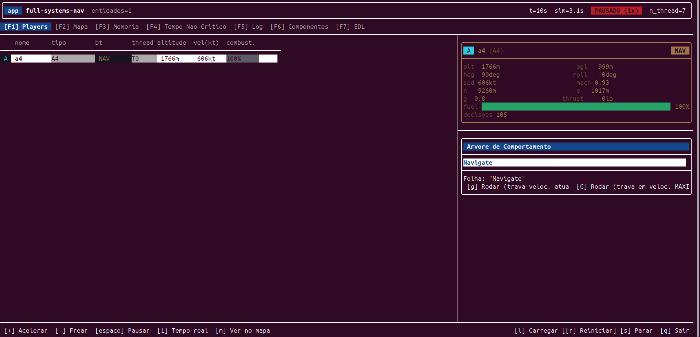
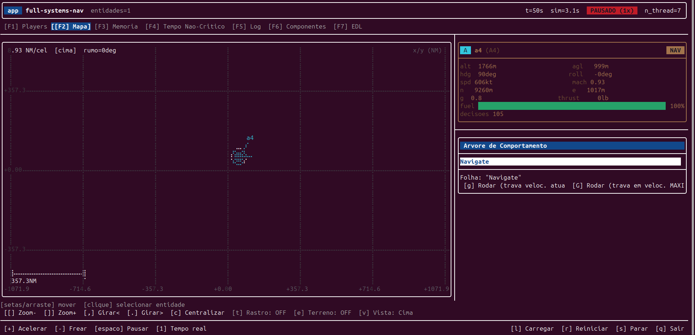
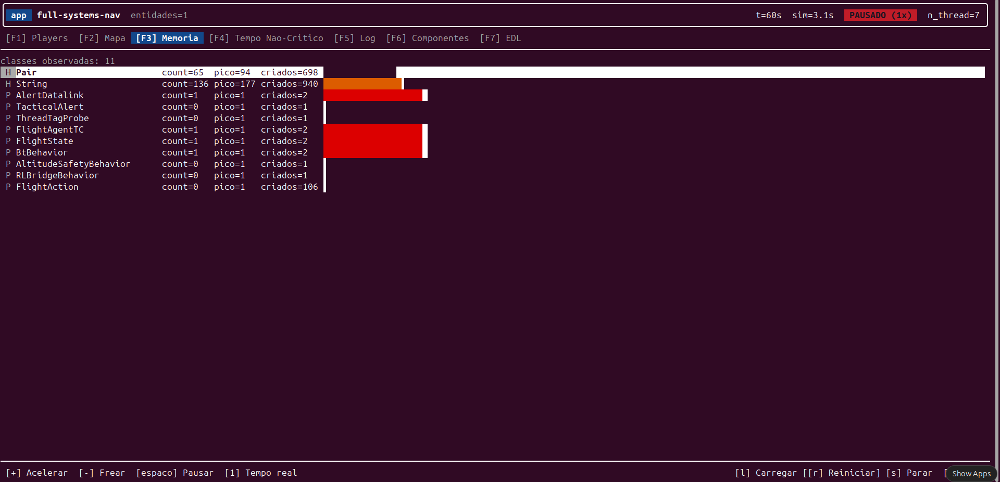
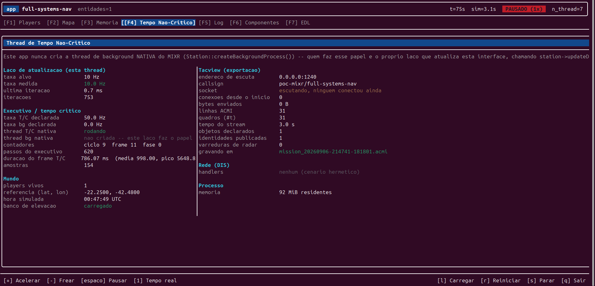
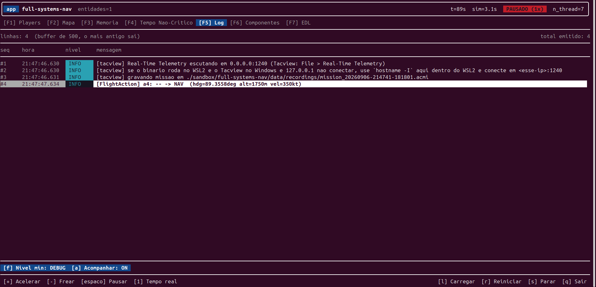
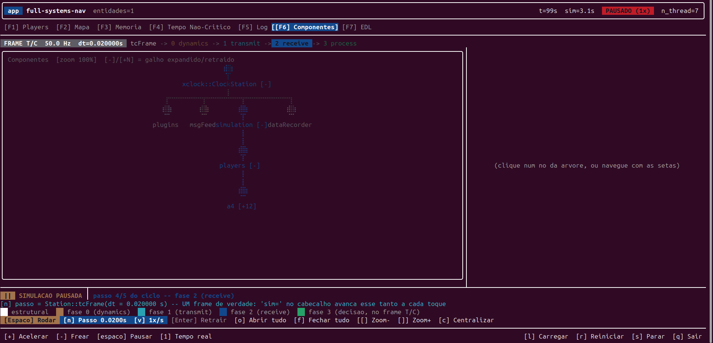
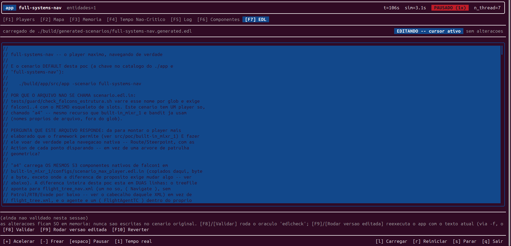

# `app` — painel de controle (TUI)

Aplicação de terminal ([FTXUI](https://github.com/ArthurSonzogni/FTXUI): cores, teclado e mouse,
redesenho responsivo) para **carregar, acompanhar e controlar** uma simulação — em vez de ler uma
linha de status em texto puro. É o **runner único** de todas as provas de conceito deste
repositório: não presume pilha nenhuma fixa, lê qualquer player pela base `mixr::models::Player` e
descobre entidades em runtime, então funciona com **qualquer** modelo carregado, não só o de
produção (ver [§7](#7-arquitetura-em-uma-frase)). Mora fora de `src/` — não é "mais uma poc", é a
ferramenta de controle das demais — por isso tem pasta própria na raiz e o binário se chama `app`,
não `dashboard`.

> Documentação em português do Brasil; identificadores e rótulos que vêm do modelo (`PATROL`,
> `EVADE`, nomes de nó...) ficam como estão.

## 1. Como se usar

```bash
make configure && make build   # a partir da raiz do repositorio -- ver README.md raiz
make run-app                   # abre a tela de selecao da pasta ./sandbox
```

Ou o binário direto, sempre a partir da **raiz** do repositório (`configs:`/`data:` são caminhos
relativos). É obrigatório passar exatamente um de `-f`/`-folder` — rodar sem nenhum é erro fatal,
não abre tela nenhuma:

```bash
./build/app/src/app -f src/poc/dis/flight/configs/scenario.edl.in        # uma poc de src/poc/**, direto -- ver §3
./build/app/src/app -folder src/poc/dis -scenario bandit                 # idem, quando a frota nao e falcon1..4
./build/app/src/app -folder ./sandbox                                    # navega uma pasta de cenarios soltos
```

Cada cenário já vem com porta de Tacview e diretório de dados próprios (ver
[§6](#6-portas-e-arquivos)) — dá pra rodar mais de um ao mesmo tempo sem colidir.

O cabeçalho e a barra de ações ficam **sempre visíveis** — trocar de aba não perde o controle de
tempo. **Toda tecla tem um botão equivalente** (clicável, com a dica do atalho no próprio rótulo).

**Globais, em qualquer aba:**

| tecla | ação |
|---|---|
| `+`/`-` | acelera / freia o tempo simulado |
| espaço / `p` | pausa / retoma |
| `1` | volta ao tempo real (1×) |
| `F1`–`F7` | troca de aba |
| `g` / `G` / `x` | roda até o breakpoint armado (na velocidade atual / na máxima) / cancela — ver [§4](#4-árvore-de-comportamento-e-breakpoints) |
| `r` / `q` | reiniciar / sair — as duas **pedem confirmação** (`Enter` confirma, `Esc` cancela) |
| `Ctrl+C` | sai na hora, sem confirmação |

**As sete abas:**

| aba | mostra | controles próprios |
|---|---|---|
| **Players** | lista de entidades (qualquer tipo, não só aviões) + card de detalhe | `↑`/`↓` navega; `m` abre a mesma entidade no Mapa |
| **Mapa** | canvas navegável, duas perspectivas | arrastar/setas move; `[`/`]`/roda zoom; `v` perspectiva; `f` segue a selecionada; `t` rastro; `e` terreno; `,`/`.` gira; `c` centraliza |
| **Memória** | contadores de instância do MIXR, ao vivo | `↑`/`↓` navega |
| **Tempo Não-Crítico** | o que roda na thread de background (10 Hz) | só leitura |
| **Log** | buffer de [`libs/xlog`](../libs/xlog/README.md) — host e modelo | `f` cicla o filtro por nível; `a` liga/desliga "acompanhar" |
| **Componentes** | árvore real de componentes da `Station` | setas navega; `Enter` abre/fecha; `o`/`f` abre/fecha tudo; `n` passo manual; `v` velocidade da animação |
| **EDL** | editor em memória do cenário carregado | `F8` valida; `F9` roda a versão editada; `F10` reverte |

## 2. As abas, uma a uma

**Players.** O card de detalhe traz posição/atitude/velocidade/Mach/G/empuxo (quando fazem
sentido pro tipo), combustível, pista de radar mais próxima, alerta tático e — se a entidade tem
árvore de comportamento — a árvore inteira ([§4](#4-árvore-de-comportamento-e-breakpoints)).



**Mapa.** **Cima** (padrão): Norte/Leste em milhas náuticas, com barra de escala. **Lado**:
largura × altitude em pés, com piso em -1000 ft. Os eixos são sempre relativos ao ponto
centralizado (o "pan"), não ao mundo absoluto. **Terreno** (`e`, desligado por padrão): curvas de
nível (Cima) ou linha de contorno vermelha (Lado) — cobre **todos** os tiles `.hgt` encontrados em
`shared/data/terrain/srtm/`, não só o do cenário; fora de toda cobertura, simplesmente não desenha
nada ali (nunca inventa elevação). Clicar numa entidade seleciona — sincroniza com a aba Players.

**Seguir** (`f`, ou o botão `[f] Seguir`, desligado por padrão): prende a vista à entidade
selecionada — ela fica no **centro exato** do canvas a cada quadro, nas **duas** perspectivas (de
cima o centro é a posição N/E; de lado, também a altitude). O **zoom continua inteiramente seu**:
`[`/`]`/roda ampliam e reduzem sem soltar a entidade, e `,`/`.` giram em torno dela. Trocar a
seleção (na lista de Players ou clicando no mapa) muda quem é seguido, e o cabeçalho do canvas
mostra `seguindo=<nome>` — abreviado com `..`, ou reduzido a `[seg]`, quando o terminal é estreito
demais para o nome inteiro caber sem cobrir a legenda dos eixos. **Mover a vista à mão — setas ou
arrastar — desliga o seguir**, senão o próximo quadro desfaria o gesto e a vista pareceria
travada; um clique de seleção com um caractere de tremor conta como arrastar e também desliga
(aperte `f` de novo). Desligar **congela** a vista onde ela está, sem pulo. Com o terreno ligado
na vista de lado, seguir tem prioridade sobre a ancoragem do chão no rodapé da janela (os dois
disputam a mesma referência vertical).

A barra de botões do Mapa passou a ter nove itens e só cabe inteira a partir de **130 colunas**;
abaixo disso o FTXUI encurta os rótulos da direita (`[e] Terreno`, `[v] Vista`) — as ações
continuam todas acessíveis pelas teclas.



**Memória.** `count=`/`pico=`/`criados=` por classe carregada (do host e do(s) plugin(s)). O
selo `CRESCENDO` aparece quando `count` nunca caiu numa janela de ~3 s e termina maior que
começou — sinal de possível vazamento, sem esperar o processo terminar.



**Tempo Não-Crítico.** Este `app` nunca cria a thread de fundo nativa do MIXR — quem faz esse
papel é o próprio laço que atualiza a interface (`station->updateData(dt)`, 10 Hz). A aba mostra a
taxa alvo vs. medida, os contadores do executivo de tempo crítico, o estado da exportação Tacview
(socket, linhas ACMI, varreduras de radar), se o terreno carregou, quantos handlers de rede
existem (os cenários deste app são herméticos: aparece "nenhum") e a memória residente do
processo.



**Log.** Como `xlog` é `shared_library()` — uma cópia só no processo — o que o **modelo** loga de
dentro do `.so` aberto por `dlopen` cai no mesmo buffer que o do host; quem produz o conteúdo é
sempre o modelo, o `app` só exibe. `f` cicla o filtro por nível mínimo (DEBUG→INFO→WARNING→ERROR);
`a` gruda a seleção na linha mais recente — qualquer `↑` desliga sozinho, voltar ao fim religa.



**Componentes.** A árvore **real** de componentes MIXR da `Station` (não a árvore de
comportamento — essa é a de Players/Mapa). Nasce expandida só até profundidade 3; o card de
detalhe mostra o estado **vivo** do componente selecionado, lido por getter público do próprio
objeto. A animação de fluxo (pulso percorrendo as fases do frame de tempo crítico) é um **modelo
conceitual**, não uma medição — o MIXR é dependência binária, sem instrumentação real possível.
`Espaço` aqui pausa a simulação de verdade (a mesma pausa global); `n` avança um `tcFrame()` real.



**EDL.** Edita o `.edl` do cenário **JÁ CARREGADO**, em memória — não monta um cenário do zero
(para isso, use o editor gráfico web, [`src/ui/`](../src/ui/)). Nunca escreve no `.edl.in` de
origem nem no `.generated.edl` carregado, só num arquivo de trabalho à parte
(`app/data/edl_editor/`, gitignored). `F8` valida contra o mesmo oráculo `edlcheck` de `src/ui/`;
`F9` valida e, se OK, **reexecuta** o processo com `-f` apontando pro texto editado (nunca duas
`Station`s no mesmo processo); `F10` descarta a edição.



## 3. Cenários

Não há mais catálogo estático embutido no binário — toda poc sob `src/poc/` (nenhuma com
executável próprio) é alcançável por `-f`/`-folder`:

```bash
./build/app/src/app -f src/poc/dis/flight/configs/scenario.edl.in          # frota falcon1..4
./build/app/src/app -folder src/poc/dis -scenario bandit                   # frota {bandit1} -- precisa de -folder
./build/app/src/app -folder src/poc     -scenario python-flight           # ou onnx-policy, built-in_mixr_1, full-systems-nav
```

`-f <arquivo.edl>` carrega um cenário apontado direto pelo caminho — assume sempre a frota
`falcon1..4` (o caso de `flight`/`python-flight`/`onnx-policy`/`built-in_mixr_1`, e das fixtures
de teste). Um cenário com frota diferente (ex.: `bandit`, `{bandit1}`; `full-systems-nav`, `{a4}`)
tem de ser carregado por `-folder` em vez de `-f`, que descobre a frota em runtime.

`-folder <pasta>` navega `<pasta>/<cenário>/configs/*.edl(.in)` — sozinho (sem `-scenario`) abre a
tela de navegação; combinado com `-scenario <subpasta>`, pula direto pra ela. Só funciona quando
`configs/` tem exatamente **um** `.edl`/`.edl.in`.

**Outras opções de linha de comando:**

| opção | efeito |
|---|---|
| `-threads <N>` | força o tamanho do pool de tempo crítico (padrão: metade dos núcleos; em todos os casos o teto é `hardware_concurrency() - 1`) |
| `-deterministic <N>` | roda N frames de passo fixo e sai — sem TUI/TTY, imprime `frame=` + relatório de instâncias; é o caminho usado por `make test` |

## 4. Árvore de comportamento e breakpoints

No card de detalhe (Players e Mapa), a árvore de comportamento aparece inteira, com a folha
vencedora destacada. Clique numa folha para selecioná-la como alvo; `g`/`G` roda a simulação — na
velocidade atual ou na máxima — até a entidade selecionada **no momento de armar** chegar naquela
folha, e então **pausa de verdade**. **Não há desarme automático por tempo**: só sai por atingir
ou por `x`.

> O destaque da folha ativa é por comparação de texto entre o nome do nó e o rótulo publicado —
> um nó cujo C++ decide em runtime entre rótulos sem relação com o próprio nome não acende,
> mesmo sendo a folha certa (ver [§8](#8-limitações-conhecidas)).

## 5. Ações disruptivas

`r`/`q` sempre pedem confirmação. `r` derruba a `Station` atual e **reexecuta o próprio processo**
(`execv`) com o mesmo cenário (`-f`/`-folder`, conforme a origem) — nunca uma segunda simulação no
mesmo processo; `q` só encerra. `F9` da aba EDL usa o mesmo mecanismo de reexec, com `-f` apontando
pro texto editado.

## 6. Portas e arquivos

Cada cenário declara a própria porta de Tacview e o próprio diretório de gravação no `.edl.in`
(`./src/poc/<nome>/data/recordings/`) — ver o README de cada poc sob `src/poc/` para os valores.
`networks:` (DIS) só existe em `flight`/`bandit`; os demais são herméticos.

O terreno é compartilhado entre cenários (`./shared/data/terrain/srtm/`). O cenário expandido de
qualquer `-f`/`-folder` vai para `./build/generated-scenarios/` — gitignored, fora de qualquer
`configs/` rastreado no git.

## 7. Arquitetura, em uma frase

`main.cpp` só orquestra (tela → expande `.edl.in` → monta `Station` → `DashboardLoop` ou
`DeterministicRun` → desliga → reexecuta se for o caso); `DashboardLoop.cpp` roda duas threads
(simulação a 10 Hz publicando estado sob mutex; a principal só desenha/lê entrada), e cada aba é
um par `.hpp`/`.cpp` **sem FTXUI nem MIXR direto**, testável isolado. O histórico completo de cada
decisão de design — e as armadilhas encontradas rodando — está na seção `./app` do
[CLAUDE.md](../CLAUDE.md); este README não repete o que já está lá.

## 8. Limitações conhecidas

- Destaque de folha ativa e casamento de breakpoint são por texto, não por mapeamento formal.
- A árvore mostrada (Players/Mapa) vem do primeiro `treeFile:` do cenário — se players diferentes
  usassem árvores diferentes, todos veriam a mesma (não acontece em nenhum cenário hoje).
- `bandit1` sempre mostra `-` na coluna "thread" — não tem `FlightAgentTC` local, nunca decide.
- A animação de fluxo da aba Componentes é conceitual, não uma medição real do frame.
- `-deterministic` não abre o painel — é o caminho de teste automatizado, sem TUI nem TTY.
- **Sem `-deterministic`, este binário exige um TTY interativo de verdade.** Rodar qualquer modo
  com TUI sob pipe/redirecionamento/CI (sem terminal real) **trava o processo indefinidamente**
  dentro de `ScreenInteractive::Fullscreen()` — não é um bug desta rodada, é característica do
  FTXUI (medido e detalhado em [CLAUDE.md](../CLAUDE.md), seção `./app`, "vigésima quinta
  passada"). Para automação/CI use `-deterministic` ou [`src/node/`](../src/node/README.md), que
  não abrem TUI nenhuma.

## 9. Leia mais

| documento | quando ler |
|---|---|
| [CLAUDE.md](../CLAUDE.md), seção `./app` | toda decisão de design e armadilha, rodada por rodada |
| [README.md](../README.md) (raiz) | pré-requisitos, build, como o repositório se organiza |
| [libs/README.md](../libs/README.md) | as bibliotecas que este app consome (`xboard`, `xtrack`, `xlog`...) |
| [CONTRIBUTING.md](../CONTRIBUTING.md) (raiz) | como um modelo vira plugin, como escrever um novo |
| [tests/README.md](../tests/README.md) | a suíte automatizada, inclusive `scenario-app-*` |
